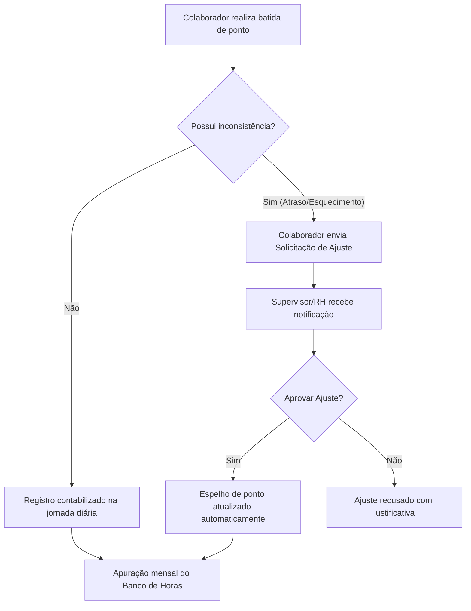
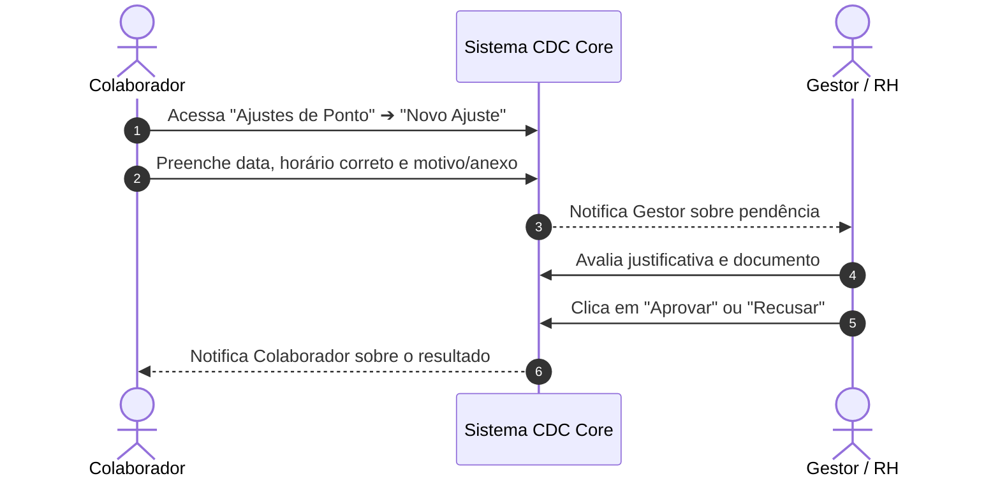

# ⏱️ Manual do Usuário — Ponto e Frequência

Este documento instrui colaboradores e gestores sobre a utilização do módulo de **Ponto e Frequência** do **CDC Core**.

---

## 1. Visão Geral do Fluxo de Ponto

---

## 2. Como Registrar o Ponto Diário

1. Acesse o sistema com suas credenciais em `http://127.0.0.1:8000/login/`.
2. No topo da tela (Barra Superior) ou no menu **Meus registros de ponto**, clique no botão **Iniciar / Marcar Ponto**.
3. O sistema registrará automaticamente a hora atual, o endereço IP e a geolocalização da batida.
4. Para visualizar suas batidas do dia ou do mês, navegue até **Meus Dados ➔ Meus registros de ponto**.

---

## 3. Solicitação de Ajuste ou Inclusão de Ponto

Caso você tenha esquecido de bater o ponto ou precise anexar um atestado médico:

### Passo a passo para solicitar ajuste:
1. No menu lateral, acesse **Ponto e Frequência ➔ Ajustes de Ponto**.
2. Clique no botão **+ Solicitar Ajuste**.
3. Selecione a **Data**, o **Horário**, o **Tipo de Batida** (Entrada, Saída Almoço, Retorno Almoço ou Saída) e a **Justificativa**.
4. Se necessário, anexe o comprovante (ex: atestado em PDF ou imagem).
5. Clique em **Salvar**. A solicitação ficará com status `Pendente`.

---

## 4. Banco de Horas e Espelho de Ponto

- **Espelho de Ponto:** Disponível em **Ponto ➔ Meu Espelho de Ponto**. Permite emitir o relatório mensal de frequência para assinatura ou conferência.
- **Banco de Horas:** O saldo diário de horas extras ou débitos é calculado automaticamente ao final do turno e consolidado no final do mês.

| Indicador | Significado | Cor Visual |
| :--- | :--- | :--- |
| **OK** | Jornada diária cumprida exatamente como programado | 🟢 Verde |
| **+XXm** | Horas excedentes (crédito no banco de horas) | 🔵 Azul |
| **Atraso / Débito** | Horas não trabalhadas (débito no banco de horas) | 🟡 Amarelo / 🔴 Vermelho |
