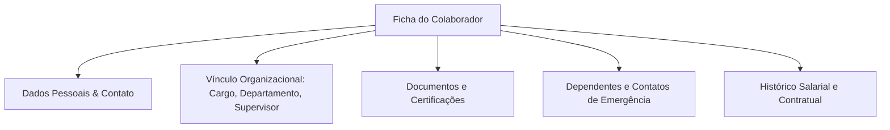
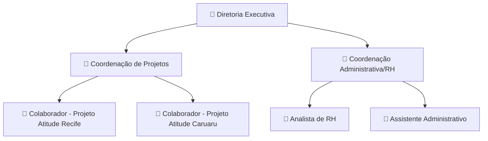

# 👥 Manual do Usuário — PIM (Gestão de Colaboradores) e Organograma

O módulo **PIM (Personal Information Management)** é responsável pelo gerenciamento dos dados cadastrais, estrutura hierárquica e documentos de todos os colaboradores do **CDC**.

---

## 1. Estrutura do Perfil do Colaborador

---

## 2. Organograma Visual da Instituição

O sistema gera o **Organograma Dinâmico** da instituição automaticamente a partir dos relacionamentos de supervisão direta cadastrados no PIM:

### Como navegar no Organograma:
1. No menu lateral, acesse **PIM ➔ Organograma**.
2. Utilize o mapa interativo para expandir ou recolher os setores e equipes.
3. Clique sobre qualquer colaborador para visualizar seu cargo, ramal e supervisor imediato.

---

## 3. Gestão de Documentos e Dependentes (Self-Service)

Colaboradores podem manter seus dados atualizados e anexar documentos diretamente pelo portal:

1. Acesse **Meus Dados ➔ Meu Perfil**.
2. Na aba **Documentos**, clique em **Adicionar Anexo** para enviar RG, CPF, comprovante de residência ou certificados.
3. Na aba **Dependentes**, inclua filhos ou dependentes legais para fins de benefícios.
