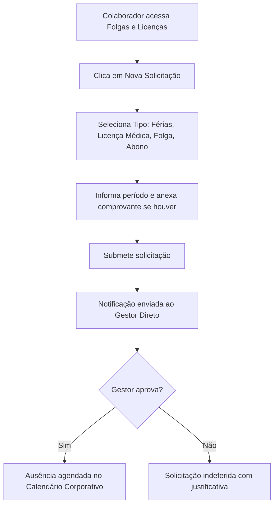

# 🏖️ Manual do Usuário — Folgas, Licenças e Férias

Este manual detalha o processo de solicitação e aprovação de ausências corporativas no **CDC Core**.

---

## 1. Fluxo de Solicitação de Ausência

---

## 2. Tipos de Ausências Suportadas

| Tipo de Ausência | Comprovante Obrigatório? | Afeta Saldo de Férias? |
| :--- | :---: | :---: |
| **Férias Regulamantares** | Não | Sim |
| **Licença Médica / Atestado** | Sim (PDF / Foto do atestado) | Não |
| **Folga Compensatória (Banco de Horas)** | Não | Não (Desconta do banco) |
| **Licença Maternidade / Paternidade** | Sim (Certidão) | Não |
| **Abono / Gala / Luto** | Sim (Comprovante legal) | Não |

---

## 3. Como Solicitar Férias ou Ausências

1. Acesse no menu lateral: **Meus Dados ➔ Minhas Ausências**.
2. Clique no botão **+ Nova Solicitação**.
3. Selecione o **Tipo de Licença**, a **Data de Início** e a **Data de Término**.
4. Escreva uma breve observação explicativa.
5. Clique em **Enviar Solicitação**. Você poderá acompanhar o status (`Pendente`, `Aprovado` ou `Recusado`) na própria tabela.
