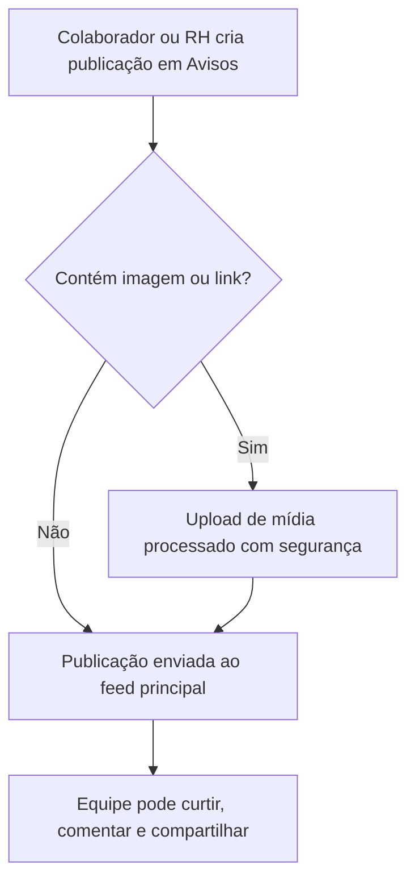

# 📢 Manual do Usuário — Canal de Avisos Corporativos

O canal de **Avisos** é o feed interno de comunicação do **CDC**, permitindo que a equipe compartilhe comunicados, conquistas, fotos de eventos e informativos institucionais.

---

## 1. Funcionamento do Feed de Avisos

---

## 2. Como Fazer uma Publicação em Avisos

1. Acesse no menu lateral: **Principal ➔ Avisos**.
2. No campo **O que você quer compartilhar hoje?**, digite sua mensagem.
3. Clique nos ícones de mídia para anexar fotos ou links.
4. Clique em **Publicar**.

---

## 3. Diretrizes de Conduta e Moderação

Para manter um ambiente profissional e respeitoso, o canal de Avisos conta com ferramentas de moderação:

- **Denúncia de Conteúdo:** Qualquer colaborador pode clicar no ícone de bandeira em uma postagem inapropriada para enviar uma denúncia para a equipe de RH.
- **Painel de Moderação (`/buzz/central-suporte/`):** Apenas administradores e equipe de RH têm acesso para analisar denúncias e aplicar ações de moderação quando necessário.
