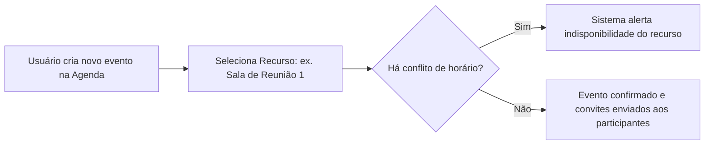

# 📅 Manual do Usuário — Agenda Corporativa e Reserva de Recursos

O módulo de **Agenda** permite o agendamento de compromissos, reuniões de projetos e reserva de recursos compartilhados da instituição (salas de reunião, projetores e veículos corporativos).

---

## 1. Fluxo de Reserva de Recursos

---

## 2. Como Agendar uma Reunião ou Reserva

1. Acesse no menu lateral: **Meus Dados ➔ Meu Calendário** (ou **Agenda**).
2. Clique na data/hora desejada ou no botão **+ Novo Evento**.
3. Preencha o **Título**, **Descrição**, **Horário de Início e Término**.
4. Selecione o **Local / Sala** desejada.
5. Adicione os e-mails dos participantes (internos ou externos).
6. Clique em **Salvar e Convidar**. Os participantes receberão a notificação de compromisso.
