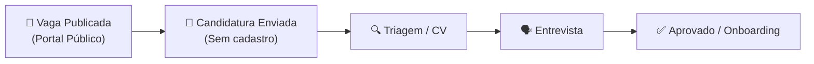

# 🎯 Manual do Usuário — Recrutamento e Gestão de Vagas

Este manual orienta a equipe de RH sobre a publicação de oportunidades de trabalho e gestão do funil de candidatos no **CDC Core**.

---

## 1. Funil de Seleção e Pipeline de Candidatos

---

## 2. Portal Público de Vagas (Sem cadastro)

- **URL Externa de Vagas:** `/recruitment/public/`
- Permite que candidatos externos consultem oportunidades abertas no **Centro de Desenvolvimento e Cidadania (CDC)** e enviem currículo em PDF sem necessidade de login prévio.

---

## 3. Gestão Interna de Candidatos pelo RH

1. Acesse no menu lateral: **Gestão ➔ Recrutamento ➔ Pipeline**.
2. Arraste os cards dos candidatos entre as colunas (**Inscritos**, **Em Triagem**, **Entrevista**, **Contratado**).
3. Ao mover um candidato para a etapa de **Entrevista**, o sistema gera automaticamente uma convocação via e-mail.
