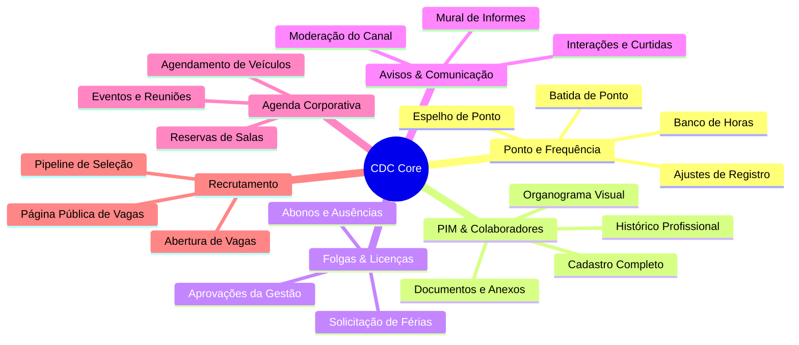
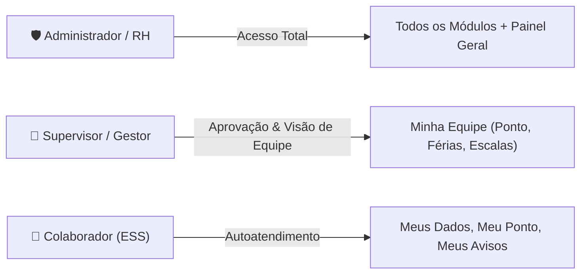

# 📖 Guia Geral de Funcionalidades — CDC Core

Bem-vindo ao **Manual do Usuário e Guia de Funcionalidades do CDC Core**. Este guia centraliza as orientações para o uso operacional de todas as ferramentas disponíveis no sistema de gestão do **Centro de Desenvolvimento e Cidadania (CDC)**.

---

## 🗺️ Mapa de Módulos e Funcionalidades

---

## 📚 Manuais Específicos por Módulo

Clique em um dos módulos abaixo para acessar o manual detalhado com passo a passo, permissões e diagramas de fluxo:

| Módulo | Descrição do Manual | Arquivo de Documentação |
| :--- | :--- | :--- |
| ⏱️ **Ponto e Frequência** | Guia de batida de ponto, espelho de ponto, solicitações de ajuste e saldo do banco de horas. | [01_ponto_e_frequencia.md](./01_ponto_e_frequencia.md) |
| 👥 **PIM & Colaboradores** | Gestão da ficha do funcionário, documentos anexos, dependentes e navegação no organograma. | [02_pim_colaboradores.md](./02_pim_colaboradores.md) |
| 🏖️ **Folgas & Licenças** | Roteiro de solicitação de férias, licenças médicas, abonos e fluxo de aprovação dos gestores. | [03_folgas_e_licencas.md](./03_folgas_e_licencas.md) |
| 📢 **Avisos & Comunicação** | Publicação de comunicados corporativos, interações da equipe e diretrizes de moderação. | [04_avisos_e_comunicacao.md](./04_avisos_e_comunicacao.md) |
| 📅 **Agenda Corporativa** | Agendamento de salas de reunião, veículos da instituição e eventos com lembretes. | [05_agenda_e_recursos.md](./05_agenda_e_recursos.md) |
| 🎯 **Recrutamento & Vagas** | Publicação de oportunidades no portal de vagas, triagem de candidatos e etapas de seleção. | [06_recrutamento_e_vagas.md](./06_recrutamento_e_vagas.md) |

---

## 🔐 Papéis de Acesso e Permissões no Sistema

O acesso às funcionalidades do CDC Core é categorizado de acordo com o perfil (Role) atribuído ao usuário:

| Papel | Descrição | Principais Ações |
| :--- | :--- | :--- |
| **Colaborador (ESS)** | Funcionário da instituição | Registrar ponto, visualizar espelho, solicitar folgas/ajustes, consultar agenda e publicar em Avisos. |
| **Supervisor** | Gestor de equipe ou projeto | Aprovar ou recusar solicitações de ponto e férias da equipe, visualizar relatórios do time. |
| **Recursos Humanos (RH)** | Equipe operacional de RH | Gerenciar cadastro de colaboradores, fechar folha de ponto, criar vagas e gerenciar permissões. |
| **Administrador** | Administrador do sistema | Controle total de configurações, auditoria de logs e parametrizações globais. |

---

## 💡 Dicas de Navegação

- **Barra Superior (Topbar):** Acesso rápido às notificações, atalho para iniciar ponto e menu do perfil.
- **Menu Lateral (Sidebar):** Organizado por seções (`PRINCIPAL`, `MEUS DADOS`, `GESTÃO` e `CONFIGURAÇÕES`).
- **Central de Suporte (`/buzz/central-suporte/`):** Canal interno para reportar bugs ou dúvidas operacionais.
